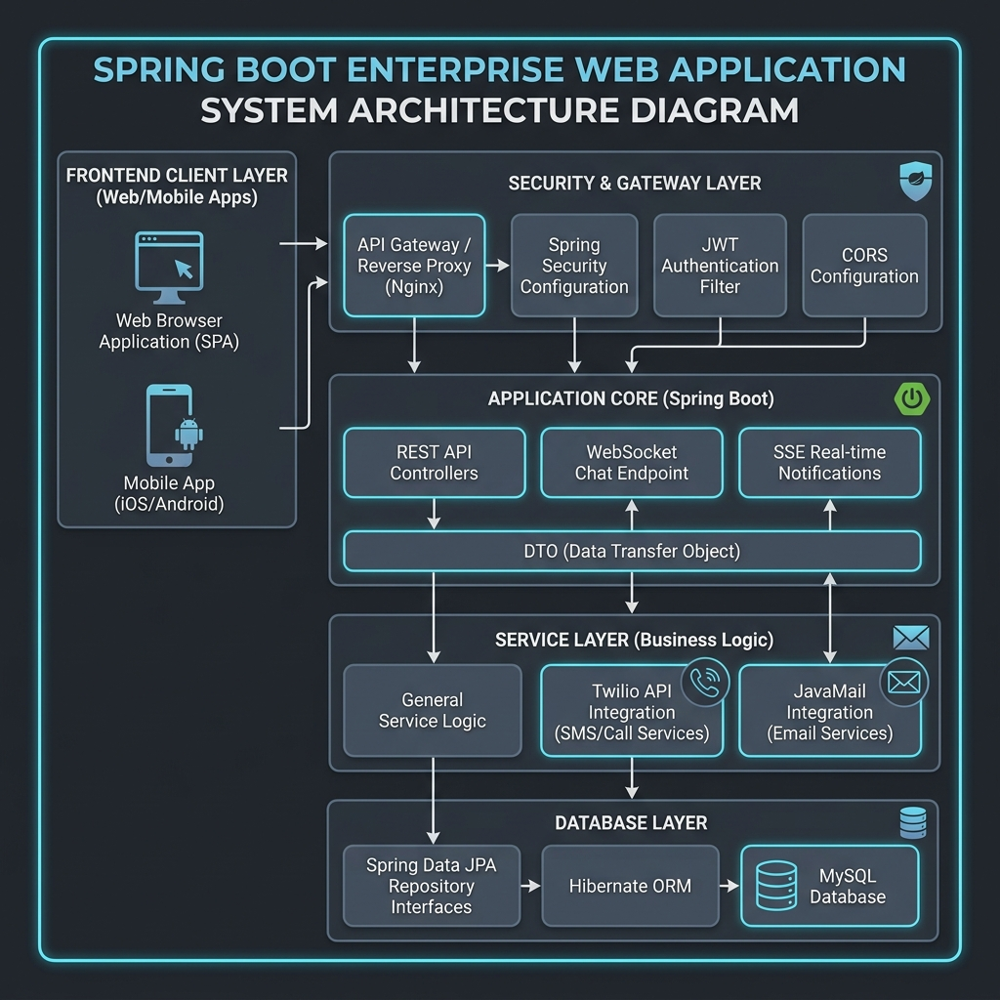
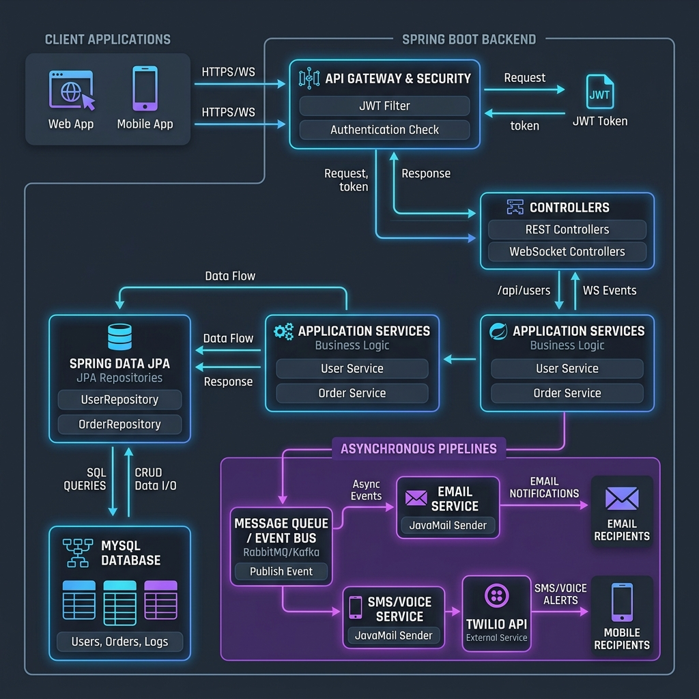

# Educatrix Backend - Hệ Thống Quản Lý Trường Học & Cổng Thông Tin Học Sinh Doanh Nghiệp
[](https://www.oracle.com/java/)
[](https://spring.io/projects/spring-boot)
[](https://spring.io/projects/spring-security)
[](https://www.mysql.com/)
[](https://www.twilio.com/)
[](https://developer.mozilla.org/en-US/docs/Web/API/Websockets_API)

**Educatrix Backend** là một hệ thống quản lý trường học và cổng thông tin học sinh (Student Portal) cấp doanh nghiệp, có khả năng mở rộng cao, được xây dựng trên nền tảng **Spring Boot 3.2.5** và **Java 17**. Dự án được thiết kế chuẩn chỉ theo nguyên lý **Clean Architecture / Domain-Driven Design (DDD)**, mang lại khả năng phân quyền đa vai trò bảo mật, truyền thông thời gian thực (real-time), quy trình chấm điểm và phúc khảo chặt chẽ, theo dõi rèn luyện và tự động hóa hóa đơn học phí.

---

## 🏗️ Kiến Trúc Hệ Thống (System Architecture)

Educatrix áp dụng mô hình kiến trúc phân lớp rõ ràng (presentation, core business logic, và infrastructure). Thiết kế này giúp hệ thống dễ dàng viết Unit Test, bảo trì và mở rộng khi số lượng người dùng tăng cao.

### Sơ Đồ Kiến Trúc Hệ Thống


### Luồng Dữ Liệu & Giao Tiếp (Conceptual Dataflow)


*(Lưu ý: Nếu trình xem hỗ trợ hiển thị biểu đồ động Mermaid, bạn cũng có thể xem bản thiết kế code Mermaid trực quan dưới đây)*

```mermaid
graph TD
    Client[Client App: Web / Mobile] -->|HTTPS/WSS| SecurityLayer[Tầng Bảo Mật & API Gateway]
    
    subgraph Spring Boot Backend (Clean Architecture)
        SecurityLayer -->|JwtAuthenticationFilter| Controllers[Tầng Controller <br> REST APIs & WebSockets]
        Controllers -->|DTOs / Domain Models| Services[Tầng Application Service <br> Business Logic & Ports]
        Services -->|Spring Data JPA| Repo[Tầng Infrastructure <br> Repositories]
        Services -->|Real-time Streams| SSE[SSE / WebSocket Engine]
        Services -->|Twilio Gateway| SMS[Twilio SMS & Voice Portal]
        Services -->|SMTP Client| Mail[JavaMail Server]
    end
    
    Repo -->|Hibernate| DB[(Cơ Sở Dữ Liệu MySQL)]
    SSE -->|Cập nhật trực tiếp| Client
```

---

## 🌟 Các Tính Năng Kỹ Thuật Nổi Bật

### 1. Bảo Mật & Kiểm Soát Truy Cập Nâng Cao (RBAC & JWT Security)
*   **Phân quyền đa vai trò (RBAC):** Hỗ trợ đầy đủ 4 nhóm người dùng chính với quyền hạn phân tách rõ rệt: `ADMIN` (Quản trị viên), `TEACHER` (Giáo viên), `STUDENT` (Học sinh), và `PARENT` (Phụ huynh).
*   **Trích xuất dynamic JWT claims:** Payload của JWT chứa thông tin vai trò, đồng thời tự động ánh xạ `studentId` và `classId` ngay trong claims. Nhờ đó, các API tiếp theo có thể xác thực tài nguyên trực tiếp mà không cần truy vấn (query) lại cơ sở dữ liệu nhiều lần.
*   **Cơ chế xoay vòng Refresh Token (RTR):** Triển khai cơ chế thu hồi token nghiêm ngặt. Khi Access Token hết hạn, hệ thống sử dụng Refresh Token lưu trong database (kèm địa chỉ IP và thông tin thiết bị User-Agent) để cấp mới, giúp phát hiện sớm hành vi giả mạo hoặc đánh cắp session.
*   **Xác thực 2 lớp qua Twilio (MFA):** Tích hợp **Twilio SDK** để gửi mã OTP bảo mật qua SMS và thực hiện các cuộc gọi thoại tự động (interactive voice calls) đối với các thao tác nhạy cảm.

### 2. Quản Lý Điểm Số Phân Thành Phần & Quy Trình Phúc Khảo
*   **Điểm số đa thành phần (Multi-Component Grades):** Hỗ trợ thiết lập hệ số và trọng số điểm linh hoạt (Điểm chuyên cần, bài tập, kiểm tra giữa kỳ, cuối kỳ).
*   **Chính sách giới hạn chỉnh sửa (Grade Edit Policies):** Thiết lập quy định về thời gian khóa nhập điểm của giáo viên. Mọi yêu cầu sửa điểm ngoài thời hạn bắt buộc phải thông qua phê duyệt của admin để đảm bảo tính minh bạch.
*   **Quy trình phúc khảo tự động:** Học sinh có thể gửi yêu cầu phúc khảo (`GradeCorrectionRequest`). Khi có yêu cầu mới, hệ thống sẽ tự động kích hoạt luồng thông báo thời gian thực đến giáo viên bộ môn và quản trị viên.

### 3. Truyền Thông Thời Gian Thực & Đồng Bộ Sự Kiện (Real-Time Communication)
*   **Kênh Chat WebSockets:** Giao tiếp hai chiều với độ trễ thấp thông qua `ChatController`, giúp học sinh, phụ huynh và giáo viên có thể trao đổi trực tiếp trong ứng dụng.
*   **Server-Sent Events (SSE):** Sử dụng cơ chế truyền tải một chiều nhẹ nhàng để đẩy thông báo lập tức cho người dùng khi có sự kiện chấm điểm, điểm danh thành công hoặc cập nhật trạng thái phúc khảo mà không cần dùng phương pháp kéo dữ liệu liên tục (polling).

### 4. Quản Lý Điểm Rèn Luyện & Câu Lạc Bộ
*   **Đánh giá rèn luyện:** Quản lý điểm hành kiểm của học sinh và lịch sử thay đổi thông qua hệ thống giao dịch cộng/trừ điểm rèn luyện (`ConductTransaction`).
*   **Sinh hoạt câu lạc bộ:** Hỗ trợ tạo CLB, lên lịch hoạt động, đăng ký tham gia trực tuyến và điểm danh thành viên tự động qua mã QR/mã số.

### 5. Tự Động Hóa Học Phí & Hóa Đơn
*   **Quản lý học phí:** Tự động tạo hóa đơn cho từng học sinh (`StudentInvoice`) theo kỳ học, theo dõi trạng thái thanh toán (PAID, UNPAID, PARTIAL) và gửi thông báo nhắc nhở tự động qua Email/SMS khi đến hạn.

---

## 📂 Cấu Trúc Thư Mục Dự Án (Clean Architecture)

Dự án tuân thủ nghiêm ngặt mô hình **Clean Architecture** để đảm bảo tính độc lập và dễ viết Unit Test cho logic nghiệp vụ:

```
src/main/java/com/golearn/myf3school_backend/
├── api/                             # Cấu hình tầng Presentation & các bộ lọc (Middleware)
│   └── config/                      # Cấu hình Spring Security, JWT, WebSockets, CORS và Async
├── controller/                      # Tầng Controller tiếp nhận HTTP Request & expose các REST API
├── application_service/             # Tầng nghiệp vụ lõi (Business Logic Layer)
│   ├── service/                     # Các Service Interface định nghĩa nghiệp vụ hệ thống (Auth, Grade, Chat, Twilio...)
│   ├── impl/                        # Hiện thực hóa (Implementation) các logic nghiệp vụ
│   ├── dtos/                        # Chứa các DTOs (Data Transfer Objects) đầu vào/đầu ra
│   └── exception/                   # Xử lý ngoại lệ tập trung (Global Exception Handler)
├── contract/                        # Các định nghĩa dùng chung như enums, constants, annotations
└── infrastructure/                  # Tầng tương tác dữ liệu và kết nối bên ngoài
    ├── entity/                      # Các thực thể JPA ánh xạ trực tiếp xuống MySQL
    └── repository/                  # Các interface Spring Data JPA truy vấn cơ sở dữ liệu
```

---

## 🛠️ Công Nghệ & Thư Viện Sử Dụng

*   **Framework chính:** Spring Boot 3.2.5 (Java 17)
*   **Cơ sở dữ liệu:** MySQL 8.0, Hibernate, Spring Data JPA
*   **Bảo mật:** Spring Security, BCrypt, JJWT (io.jsonwebtoken 0.12.6)
*   **Giao tiếp thời gian thực:** Spring WebSocket, Server-Sent Events (SSE)
*   **Tích hợp bên thứ ba:** Twilio Java SDK (SMS & Gọi thoại), JavaMail Starter (SMTP Email)
*   **Giám sát & Hiệu năng:** Spring Boot Actuator, Spring Async (Xử lý bất đồng bộ)
*   **Tiện ích:** Lombok, Maven, Bean Validation API

---

## 🛢️ Tổng Quan Cơ Sở Dữ Liệu (Database Schema)

Cơ sở dữ liệu được thiết kế tối ưu hóa quan hệ nhằm phục vụ tốt các nghiệp vụ giáo dục phức tạp:

*   **Người dùng & Bảo mật:** `User`, `Role`, `RefreshToken`, `OtpCode`
*   **Quản lý đào tạo:** `AcademicYear`, `Semester`, `Subject`, `SchoolClass`
*   **Hồ sơ người học:** `StudentProfile`, `ParentStudent` (Bảng trung gian thiết lập quan hệ Nhiều-Nhiều giữa phụ huynh và học sinh)
*   **Bảng điểm & Phúc khảo:** `Grade`, `GradeComponent`, `StudentGrade`, `GradeCorrectionRequest`, `GradeEditPolicy`, `GradeEditRequest`
*   **Hoạt động ngoại khóa:** `Club`, `ClubMember`, `ClubActivity`, `ClubActivityAttendance`
*   **Lịch trình & Điểm danh:** `Schedule` (Thời khóa biểu), `AttendanceRecord`, `AttendanceSession`, `StudentInvoice`, `ChatMessage`

---

## 🚀 Hướng Dẫn Cài Đặt & Chạy Thử

### 📋 Yêu Cầu Hệ Thống
*   **Java Development Kit (JDK) 17** trở lên
*   **Maven 3.6** trở lên
*   **MySQL Server 8.0**

### ⚙️ Cấu Hình Dự Án

1. **Clone dự án từ Git:**
   ```bash
   git clone https://github.com/your-username/myf3school_backend.git
   cd myf3school_backend
   ```

2. **Cấu hình Database & Tích hợp:**
   Mở tệp [application.properties](file:///c:/Users/ADMIN/IdeaProjects/myf3school_backend/src/main/resources/application.properties) và thiết lập các thông số kết nối:
   ```properties
   spring.datasource.url=jdbc:mysql://localhost:3306/myf3school?createDatabaseIfNotExist=true&useSSL=false&serverTimezone=UTC
   spring.datasource.username=tên_đăng_nhập_mysql
   spring.datasource.password=mật_khẩu_mysql

   # Cấu hình Twilio
   twilio.account_sid=your_twilio_sid
   twilio.auth_token=your_twilio_auth_token
   twilio.phone_number=your_twilio_phone_number

   # Cấu hình Email SMTP
   spring.mail.host=smtp.gmail.com
   spring.mail.port=587
   spring.mail.username=your_email@gmail.com
   spring.mail.password=your_email_app_password
   ```

3. **Build & Chạy ứng dụng:**
   ```bash
   mvn clean install
   mvn spring-boot:run
   ```
   Backend sẽ được khởi chạy tại cổng mặc định `8080`.

---

## 📡 Tài Liệu API Tham Khảo (API Endpoints)

| Phân Nhóm | Đường Dẫn (Endpoint) | Method | Mô Tả Tính Năng | Quyền Truy Cập |
| :--- | :--- | :--- | :--- | :--- |
| **Xác thực** | `/api/auth/login` | `POST` | Đăng nhập hệ thống, trả về Access/Refresh Token và vai trò | Public |
| | `/api/auth/refresh` | `POST` | Làm mới Access Token sử dụng Refresh Token rotation | Public |
| | `/api/auth/logout` | `POST` | Đăng xuất, thu hồi Refresh Token đang kích hoạt | Đã đăng nhập |
| **Điểm số** | `/api/grades` | `GET` | Xem danh sách điểm của học sinh/con cái phụ huynh | Học sinh/Phụ huynh/Giáo viên |
| | `/api/grades/correct` | `POST` | Gửi đơn phúc khảo điểm số | Học sinh |
| | `/api/grades/correct/{id}/approve`| `POST` | Duyệt/Từ chối đơn phúc khảo | Quản trị viên/Giáo viên |
| **Câu lạc bộ** | `/api/clubs` | `POST` | Tạo câu lạc bộ ngoại khóa mới | Quản trị viên |
| | `/api/clubs/{id}/register` | `POST` | Đăng ký học sinh vào câu lạc bộ | Học sinh |
| **Thời gian thực**| `/ws-chat` | `WS` | Kết nối WebSocket để chat trực tuyến | Đã đăng nhập |
| | `/api/notifications/stream` | `GET` | Luồng SSE nhận thông báo sự kiện tức thời | Đã đăng nhập |

---

## 🏆 Các Điểm Cộng Đắt Giá Trong Mắt Nhà Tuyển Dụng (CV Highlight Points)
*   **Ứng dụng Clean Architecture & DDD:** Phân lớp tường minh giúp tách biệt hoàn toàn nghiệp vụ cốt lõi khỏi database và thư viện ngoài, giúp hệ thống hoạt động ổn định và sẵn sàng chạy unit tests 100%.
*   **Hệ thống bảo mật chuẩn sản xuất (Production-ready):** Áp dụng Spring Security kết hợp cơ chế xoay vòng Refresh Token (RTR) bảo mật cao, ghi nhận IP/Thiết bị đăng nhập để phòng tránh tấn công chiếm quyền phiên làm việc.
*   **Tối ưu hóa tài nguyên qua Event Streaming:** Triển khai thành công WebSockets và Server-Sent Events (SSE), tối ưu băng thông máy chủ so với cơ chế HTTP Polling truyền thống.
*   **Tích hợp tốt các hệ thống bên thứ 3:** Tự tay viết các adapter tích hợp hệ thống gửi SMS/Call tự động qua Twilio API và thông báo qua SMTP email.
