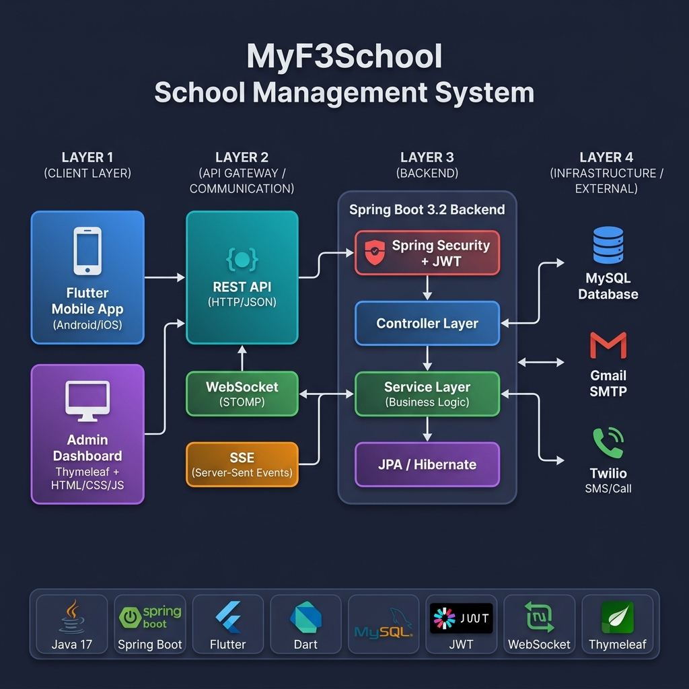
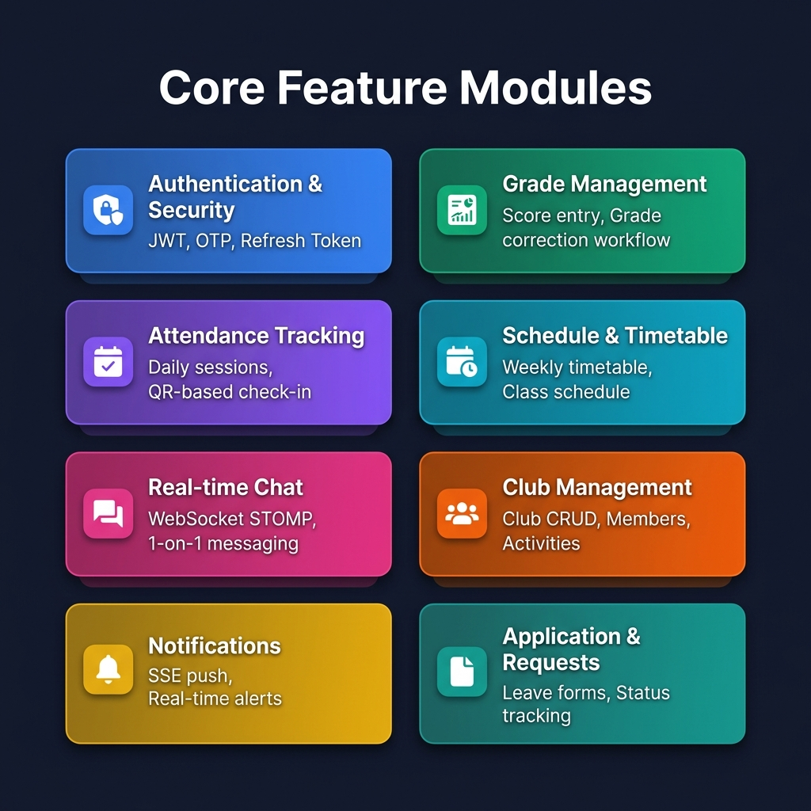

<div align="center">

# 🎓 MyF3School — Hệ Thống Quản Lý Trường Học

### Nền tảng Quản lý Trường học Fullstack với Flutter Mobile App & Spring Boot REST API

[](https://openjdk.org/)
[](https://spring.io/projects/spring-boot)
[](https://flutter.dev/)
[](https://dart.dev/)
[](https://www.mysql.com/)
[](https://jwt.io/)
[](https://stomp.github.io/)
[](LICENSE)

---

**MyF3School** là hệ thống quản lý trường học toàn diện, được thiết kế để số hóa và tối ưu hóa các hoạt động học thuật cho trường phổ thông. Hệ thống phục vụ nhiều vai trò người dùng — **Học sinh, Phụ huynh, Giáo viên, Cố vấn CLB, Nhân viên và Quản trị viên** — thông qua ứng dụng di động Flutter và trang quản trị Admin Dashboard.

</div>

---

## 📐 Kiến Trúc Hệ Thống

<p align="center">
  
</p>

Hệ thống tuân theo **kiến trúc đa tầng (Multi-layered Architecture)** với sự phân tách rõ ràng giữa các lớp:

| Tầng | Công nghệ | Mô tả |
|:-----|:----------|:------|
| **Ứng dụng di động** | Flutter (Dart) | Ứng dụng đa nền tảng cho Học sinh, Phụ huynh & Giáo viên |
| **Trang quản trị** | Thymeleaf + HTML/CSS/JS | Giao diện admin được render phía server |
| **Tầng API** | Spring Boot REST + WebSocket + SSE | RESTful endpoints, chat thời gian thực & push notification |
| **Bảo mật** | Spring Security + JWT + BCrypt | Xác thực stateless với cơ chế xoay vòng access/refresh token |
| **Logic nghiệp vụ** | Service Layer (DI-based) | Phân tách rõ ràng với DTOs, Enums và Exception handling |
| **Truy cập dữ liệu** | Spring Data JPA / Hibernate | Tầng ORM kết nối MySQL |
| **Dịch vụ bên ngoài** | Gmail SMTP, Twilio SMS/Call | Gửi email thông báo & OTP qua SMS |

---

## ✨ Các Module Tính Năng Chính

<p align="center">
  
</p>

### 🔐 Xác Thực & Bảo Mật
- Đăng nhập bằng **số điện thoại + mật khẩu** với **JWT** (Access Token + Refresh Token xoay vòng)
- Luồng **Quên mật khẩu**: Gửi OTP qua **Email (SMTP)** hoặc **SMS (Twilio)** → Xác thực → Đặt lại mật khẩu
- Phân quyền theo vai trò (RBAC): `ADMIN`, `TEACHER`, `STUDENT`, `PARENT`, `CLUB_ADVISOR`, `STAFF`
- Mã hóa mật khẩu với **BCrypt** (strength 12)

### 📊 Quản Lý Điểm Số
- Giáo viên nhập điểm theo môn học, học kỳ và thành phần điểm
- **Quy trình chỉnh sửa điểm**: Giáo viên gửi yêu cầu → Admin xét duyệt → Chấp nhận/Từ chối
- Cấu hình chính sách chỉnh sửa điểm & thời hạn nhập điểm
- Học sinh & Phụ huynh xem điểm theo từng học kỳ

### ✅ Điểm Danh
- Giáo viên tạo **buổi điểm danh** hàng ngày theo lớp
- Đánh dấu trạng thái học sinh: `CÓ MẶT`, `VẮNG`, `MUỘN`, `CÓ PHÉP`
- Phụ huynh theo dõi tình hình điểm danh của con em theo thời gian thực

### 📅 Thời Khóa Biểu
- Lịch học hàng tuần với thông tin phòng, môn học và tiết học
- Lọc theo lớp và ngày trong tuần
- Hiển thị lịch học hôm nay ngay trên trang chủ ứng dụng

### 💬 Chat Thời Gian Thực (WebSocket)
- Nhắn tin 1-1 giữa các người dùng qua **STOMP over WebSocket**
- Danh sách liên hệ với các cuộc trò chuyện gần đây
- Gửi/nhận tin nhắn theo thời gian thực, không cần polling

### 🔔 Thông Báo (SSE)
- Đẩy thông báo thời gian thực qua **Server-Sent Events (SSE)**
- Scheduler heartbeat giữ kết nối luôn sống
- Đánh dấu đã đọc, xem lịch sử thông báo

### 🏫 Quản Lý Câu Lạc Bộ
- CRUD đầy đủ cho CLB, thành viên và hoạt động CLB
- Phân vai trò thành viên: `CHỦ NHIỆM`, `PHÓ CHỦ NHIỆM`, `THÀNH VIÊN`
- Điểm danh hoạt động CLB
- Yêu cầu tham gia/rời CLB với quy trình phê duyệt

### 📝 Đơn Từ & Yêu Cầu
- Học sinh gửi đơn xin nghỉ phép và các yêu cầu khác
- Theo dõi trạng thái: `CHỜ DUYỆT` → `ĐÃ DUYỆT` / `TỪ CHỐI`
- Admin/Giáo viên xem xét và phản hồi

### 👤 Hồ Sơ Người Dùng
- Xem & cập nhật thông tin cá nhân (ảnh đại diện, địa chỉ, SĐT,...)
- Liên kết quan hệ Phụ huynh – Học sinh
- Hồ sơ học tập với thông tin lớp

### 💰 Học Phí & Hóa Đơn
- Quản lý hóa đơn học sinh
- Theo dõi trạng thái thanh toán

---

## 🛠️ Công Nghệ Sử Dụng

<table>
<tr>
<td width="50%">

### Backend
| Công nghệ | Vai trò |
|:-----------|:--------|
| Java 17 | Ngôn ngữ lập trình |
| Spring Boot 3.2.5 | Framework ứng dụng |
| Spring Security | Xác thực & phân quyền |
| Spring Data JPA | ORM & truy cập dữ liệu |
| Spring WebSocket | Chat thời gian thực (STOMP) |
| Spring Mail | Gửi email (SMTP) |
| Thymeleaf | Render giao diện phía server (Admin) |
| Hibernate | Triển khai JPA |
| MySQL 8.0 | Cơ sở dữ liệu quan hệ |
| JWT (jjwt 0.12.6) | Xác thực bằng token |
| Twilio SDK | OTP qua SMS & cuộc gọi |
| Lombok | Giảm boilerplate code |
| Maven | Quản lý build & dependency |

</td>
<td width="50%">

### Frontend (Di động)
| Công nghệ | Vai trò |
|:-----------|:--------|
| Flutter 3.x | Framework UI đa nền tảng |
| Dart 3.10 | Ngôn ngữ lập trình |
| Material Design 3 | Hệ thống UI components |
| `http` | Giao tiếp REST API |
| `stomp_dart_client` | Client WebSocket cho chat |
| `shared_preferences` | Lưu trữ cục bộ (tokens) |
| `intl` | Định dạng ngày/giờ |

</td>
</tr>
</table>

---

## 📁 Cấu Trúc Dự Án

```
myf3school_fullstack/
├── 📂 myf3school_backend/           # Backend Spring Boot
│   ├── src/main/java/com/golearn/myf3school_backend/
│   │   ├── api/                     # Cấu hình, Bảo mật, Middleware
│   │   │   ├── config/              # SecurityConfig, WebSocketConfig, JwtFilter, CORS
│   │   │   └── middleware/          
│   │   ├── controller/              # 17 REST Controllers
│   │   │   ├── AuthController       # Đăng nhập, Đăng xuất, Quên mật khẩu
│   │   │   ├── GradeController      # Nhập & truy vấn điểm
│   │   │   ├── AttendanceController  # Quản lý buổi điểm danh
│   │   │   ├── ChatController       # Nhắn tin WebSocket
│   │   │   ├── ClubController       # CRUD Câu lạc bộ
│   │   │   ├── NotificationController# Đẩy thông báo SSE
│   │   │   ├── ScheduleController   # Truy vấn thời khóa biểu
│   │   │   └── ...                  # Student, User, Application,...
│   │   ├── application_service/     # Tầng Logic Nghiệp Vụ
│   │   │   ├── service/             # 16 lớp Service
│   │   │   ├── impl/               # Triển khai Service
│   │   │   ├── dtos/               # Request & Response DTOs
│   │   │   └── exception/          # Xử lý ngoại lệ tập trung
│   │   ├── infrastructure/          # Tầng Truy Cập Dữ Liệu
│   │   │   ├── entity/             # 31 JPA Entity
│   │   │   ├── repository/         # 26 Spring Data Repository
│   │   │   └── sse/                # SSE emitter registry & heartbeat
│   │   └── contract/               # Hợp đồng dùng chung
│   │       ├── enums/              # 20 kiểu Enum (Roles, Status,...)
│   │       ├── constants/          
│   │       └── annotations/        
│   └── src/main/resources/
│       ├── templates/view/admin/    # Giao diện Admin (Thymeleaf)
│       └── static/                  # CSS & JS cho Admin UI
│
├── 📂 myf3school_frontend/          # Ứng dụng di động Flutter
│   └── lib/
│       ├── main.dart                # Điểm khởi chạy ứng dụng
│       ├── app.dart                 # Cấu hình MaterialApp
│       ├── routes/                  # Định nghĩa named routes
│       ├── screen/                  # 19 trang màn hình
│       │   ├── login.dart           # Đăng nhập bằng SĐT/mật khẩu
│       │   ├── home_page.dart       # Dashboard với thống kê & lịch học hôm nay
│       │   ├── score_page.dart      # Xem điểm theo học kỳ
│       │   ├── attendance_screen.dart# Bản ghi điểm danh
│       │   ├── chat_screen.dart     # Chat thời gian thực 1-1
│       │   ├── club_screen.dart     # Danh sách & chi tiết CLB
│       │   └── ...                  # Thông báo, Lịch học, Hồ sơ,...
│       ├── model/                   # 12 Data model
│       ├── service/                 # API service (HTTP client)
│       ├── controller/              # Controller xác thực & quản lý state
│       └── widget/                  # Các widget UI tái sử dụng
│
├── 📂 docs/images/                  # Sơ đồ kiến trúc & tính năng
└── 📄 README.md                     # ← Bạn đang ở đây
```

---

## 🗄️ Sơ Đồ Cơ Sở Dữ Liệu (Các Entity Chính)

```
users ──────────── roles (Nhiều-Nhiều qua user_roles)
  │
  ├── student_profiles ──── school_classes
  │         │
  │         ├── student_grades ──── grade_components ──── subjects
  │         │
  │         ├── attendance_records ──── attendance_sessions
  │         │
  │         └── student_invoices
  │
  ├── parent_student (Liên kết Phụ huynh ↔ Học sinh)
  │
  ├── chat_messages (người gửi ↔ người nhận)
  │
  ├── notifications
  │
  ├── applications (đơn xin phép,...)
  │
  ├── otp_codes (quên mật khẩu)
  │
  └── refresh_tokens (xoay vòng JWT)

clubs ──── club_members ──── club_activities ──── club_activity_attendance
schedules ──── course_sections ──── subjects ──── school_classes
semesters ──── academic_years
grade_correction_requests ──── grade_edit_policies ──── grade_deadline_configs
conduct_scores ──── conduct_transactions
```

---

## 🚀 Hướng Dẫn Cài Đặt

### Yêu Cầu Hệ Thống

| Công cụ | Phiên bản |
|:---------|:----------|
| JDK | 17+ |
| Maven | 3.8+ |
| MySQL | 8.0+ |
| Flutter SDK | 3.x |
| Android Studio / VS Code | Mới nhất |

### 1. Clone Repository

```bash
git clone https://github.com/your-username/myf3school_fullstack.git
cd myf3school_fullstack
```

### 2. Cài Đặt Backend

```bash
# Tạo cơ sở dữ liệu MySQL
mysql -u root -p -e "CREATE DATABASE myf3school CHARACTER SET utf8mb4 COLLATE utf8mb4_unicode_ci;"

# Cấu hình thông tin kết nối database
# Chỉnh sửa: myf3school_backend/src/main/resources/application.properties

# Chạy backend
cd myf3school_backend
./mvnw spring-boot:run
```

> Server sẽ khởi chạy tại `http://localhost:8080`

### 3. Cài Đặt Frontend (Flutter)

```bash
cd myf3school_frontend

# Cài đặt dependencies
flutter pub get

# Chạy trên Android emulator
flutter run
```

> Ứng dụng Flutter kết nối tới backend qua `http://10.0.2.2:8080/api` (mặc định Android emulator)

### 4. Truy Cập Trang Quản Trị

Mở trình duyệt và truy cập:
```
http://localhost:8080/admin/dashboard
```

---

## 📡 Tổng Quan API Endpoints

| Module | Phương thức | Endpoint | Mô tả |
|:-------|:------------|:---------|:-------|
| **Xác thực** | POST | `/api/auth/login` | Đăng nhập bằng SĐT + mật khẩu |
| | POST | `/api/auth/refresh` | Làm mới access token |
| | POST | `/api/auth/logout` | Đăng xuất (thu hồi refresh token) |
| | POST | `/api/auth/forgot-password/send-otp` | Gửi OTP qua Email/SMS |
| | POST | `/api/auth/forgot-password/verify-otp` | Xác thực mã OTP |
| | POST | `/api/auth/forgot-password/reset` | Đặt lại mật khẩu |
| **Điểm số** | GET/POST/PUT | `/api/grades/**` | Quản lý điểm |
| **Điểm danh** | GET/POST/PUT | `/api/attendance/**` | Quản lý buổi & bản ghi điểm danh |
| **Lịch học** | GET | `/api/schedules/**` | Truy vấn thời khóa biểu |
| **Chat** | WS | `/ws-chat` | WebSocket STOMP endpoint |
| **Thông báo** | GET | `/api/notifications/stream` | Luồng thông báo SSE |
| **CLB** | GET/POST/PUT/DELETE | `/api/clubs/**` | Quản lý câu lạc bộ |
| **Đơn từ** | GET/POST | `/api/applications/**` | Đơn xin phép |
| **Người dùng** | GET/PUT | `/api/users/**` | Quản lý tài khoản (Admin) |

---

## 🎯 Điểm Nổi Bật Về Kỹ Thuật

<table>
<tr>
<td>🔒</td>
<td><b>Xác thực JWT Stateless</b></td>
<td>Access token + Refresh token xoay vòng với mã hóa BCrypt</td>
</tr>
<tr>
<td>⚡</td>
<td><b>Giao tiếp thời gian thực</b></td>
<td>WebSocket (STOMP) cho chat + SSE cho đẩy thông báo</td>
</tr>
<tr>
<td>🏗️</td>
<td><b>Kiến trúc sạch (Clean Architecture)</b></td>
<td>Controller → Service → Repository với DTOs và xử lý ngoại lệ tập trung</td>
</tr>
<tr>
<td>👥</td>
<td><b>Phân quyền đa vai trò (RBAC)</b></td>
<td>6 vai trò riêng biệt với phân quyền ở cấp độ method</td>
</tr>
<tr>
<td>📱</td>
<td><b>Di động đa nền tảng</b></td>
<td>Một codebase Flutter duy nhất cho Android & iOS</td>
</tr>
<tr>
<td>🔄</td>
<td><b>Quy trình chỉnh sửa điểm</b></td>
<td>Luồng phê duyệt nhiều bước với chính sách & thời hạn chỉnh sửa</td>
</tr>
<tr>
<td>📧</td>
<td><b>OTP đa kênh</b></td>
<td>Quên mật khẩu qua Email (SMTP) hoặc SMS (Twilio)</td>
</tr>
<tr>
<td>🖥️</td>
<td><b>Trang quản trị Admin</b></td>
<td>Giao diện Thymeleaf render phía server cho các thao tác quản lý</td>
</tr>
</table>

---

## 👨‍💻 Tác Giả

| **Họ tên** | Trần Xuân Huy |
| **Vị trí** | Backend Developer / Fullstack Developer (Fresher) |
| **Email** | tranxuanhuydevwork@gmail.com |
| **LinkedIn** | [linkedin.com/in/tranxuanhuydevwork](https://linkedin.com/in/tranxuanhuydevwork) |
| **GitHub** | [github.com/tranxuanhuydevwork](https://github.com/tranxuanhuydevwork) |

---

## 📄 Giấy Phép

Dự án này được cấp phép theo Giấy phép MIT — xem file [LICENSE](LICENSE) để biết thêm chi tiết.

---

<div align="center">

**⭐ Nếu bạn thấy dự án này hữu ích, hãy cho một ngôi sao nhé!**

Được xây dựng với ❤️ bằng Spring Boot & Flutter

</div>
